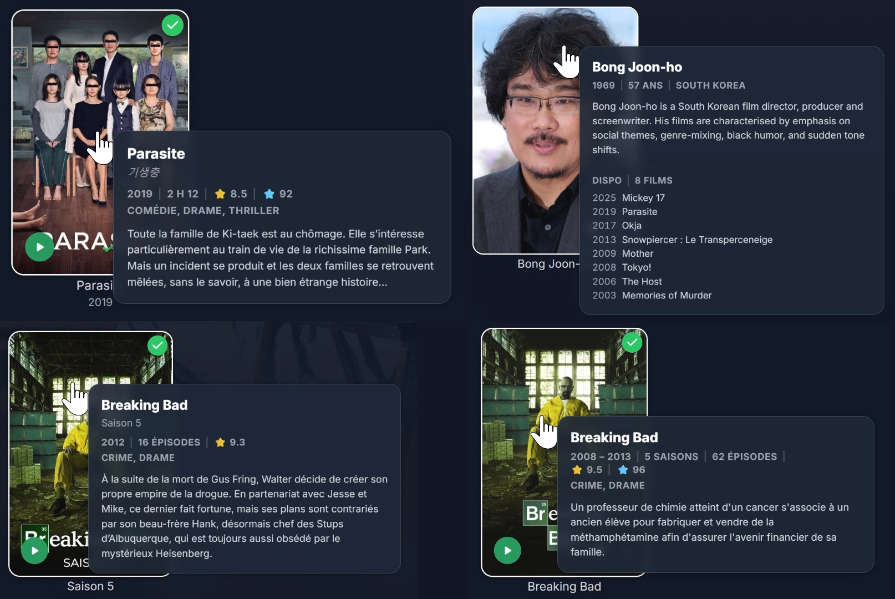

# Jellyfin Hover Peek 👆🏻💬

Display a details tooltip when hovering Movies, Series, Seasons and People cards in Jellyfin.
It shows the synopsis, ratings, genres and more after a short hover, without opening the item page.
On cast & crew cards, it shows the birth year, age, country, biography and the movies and series available on your server.
Configurable.

<p align="center">
  <br>
</p>

## Features

- **Movies**: title, original title, year, runtime, community rating, critic rating, genres, synopsis
- **Series**: years, number of seasons and episodes, ratings, genres, synopsis
- **Seasons**: series name, season, number of episodes, synopsis (falls back to the series synopsis when the season has none)
- **People (cast & crew)**: birth year, age, country, biography, and the titles available on your server
- **Episodes**: optional, disabled by default to avoid spoilers.
- **ElegantFin compatible**, and styled by the [elegantfin-jf12](https://github.com/mihaif7/elegantfin-jf12) companion CSS when installed
- **Works with or without** [Jellyfin Episodes Ratings Grid](https://github.com/Damocles-fr/jellyfin-imdb-episodes-heatmap-ratings-grid), both share the same tooltip style
- Inspired by HoverDetails mod from **JellyFrame**, [thanks @grimmdev](https://github.com/grimmdev)

## Transparency

- Heavily LLM-assisted (Opus 5.5)

## Requirements

- [**Jellyfin JavaScript Injector plugin**](https://github.com/n00bcodr/Jellyfin-JavaScript-Injector)

## Installation

#### 1. Install the [**Jellyfin JavaScript Injector plugin**](https://github.com/n00bcodr/Jellyfin-JavaScript-Injector) in your Jellyfin server if it is not already installed (need a server reboot).

#### 2. Open the Jellyfin admin ***dashboard***

#### 3. Go to: ***Dashboard*** => ***JS Injector***

#### 4. ***Add Script*** => Name it *hover-peek* or whatever => Copy/Paste :
```
(() => {
  const s = document.createElement("script");
  s.src = "https://cdn.jsdelivr.net/gh/Damocles-fr/jellyfin-hover-peek@latest/Jellyfin-Hover-Peek.js";
  s.async = true;
  (document.head || document.documentElement).appendChild(s);
})();
```

#### 5. Click ***Enabled*** => Click ***Save***

#### 6. Done, refresh (F5 or Ctrl + Shift + R) a Jellyfin page.

##### If you used the old HoverDetails script, disable it, both use the same tooltip.

##### Alternatively, you can copy and paste the full script [Jellyfin-Hover-Peek.js](./Jellyfin-Hover-Peek.js) rather than using cdn.jsdelivr. Note that this method does not support automatic updates. You can also install it only for your web-browser with an extension like *Violentmonkey*.


## Settings

With the full script (copy/paste method), you can change these settings at the top of the script, in `CONFIG`.

| Setting | Default | Options | Description |
|---|---|---|---|
| `DELAY_MS` | `700` | Number (ms) | Hover time before the tooltip appears |
| `WARM_DELAY_MS` | `300` | Number (ms) | Shorter delay when moving straight from one card to the next |
| `MOVIES` | `true` | `true` / `false` | Tooltip on movies |
| `SERIES` | `true` | `true` / `false` | Tooltip on series |
| `SEASONS` | `true` | `true` / `false` | Tooltip on seasons |
| `EPISODES` | `false` | `true` / `false` | Tooltip on episodes (Continue Watching, Next Up, Latest...) |
| `PEOPLE` | `true` | `true` / `false` | Tooltip on people (cast & crew) |
| `WIDTH_PX` | `400` | Number (px) | Tooltip width |
| `OVERVIEW_LINES` | `6` | Number | Max lines of synopsis / biography |
| `SHOW_ORIGINAL_TITLE` | `true` | `true` / `false` | Original title when different from the displayed title |
| `SHOW_RUNTIME` | `true` | `true` / `false` | Runtime (movies, episodes) |
| `SHOW_COMMUNITY_RATING` | `true` | `true` / `false` | Community rating (yellow star) |
| `SHOW_CRITIC_RATING` | `true` | `true` / `false` | Critic rating (blue star), only when the item has one in its metadata |
| `SHOW_OFFICIAL_RATING` | `false` | `true` / `false` | Parental rating (PG-13, FR-12...) |
| `SHOW_GENRES` | `true` | `true` / `false` | Genres line |
| `MAX_GENRES` | `3` | Number | Max number of genres |
| `SHOW_TAGLINE` | `false` | `true` / `false` | Movie tagline |
| `SHOW_COUNTS` | `true` | `true` / `false` | Number of seasons / episodes |
| `SEASON_USE_SERIES_INFO` | `true` | `true` / `false` | Seasons: use the series genres, and the series synopsis when the season has none |
| `PERSON_FILMOGRAPHY` | `true` | `true` / `false` | People: movies and series available on your server |
| `PERSON_FILMOGRAPHY_LABEL` | `true` | `true` / `false` | People: short label before the counts ("Here" / "Dispo") |
| `PERSON_FILMOGRAPHY_LIMIT` | `8` | Number (`0` = counts only) | People: number of titles listed |
| `PERSON_FILMOGRAPHY_SORT` | `'recent'` | `'recent'` / `'rating'` / `'name'` | People: order of the titles listed (newest, best rated, alphabetical) |
| `CACHE_MINUTES` | `30` | Number (minutes) | Cache lifetime |
| `LANGUAGE` | `'auto'` | `'auto'` / `'fr'` / `'en'` | Tooltip language. `'auto'` follows the Jellyfin display language (French or English, other languages fall back to English) |

## Technical

- It won't display on Jellyfin apps that do not use the Jellyfin Web UI & JavaScript Injector
- Compatible with Jellyfin 12.0 and above, Modern and Legacy display modes. Not tested on Jellyfin 10.11 and under
- Injects the tooltip directly into Jellyfin using the Jellyfin JavaScript Injector plugin
- A single event listener waits for the mouse to enter a card, the other listeners are only added while a card is hovered, then removed
- Data is requested only after a short hover (0.7 s by default), moving the mouse across the page doesn't send any request
- Requests use the Jellyfin API `/Items` with only the needed fields and no images, so the server only reads its database. It never uses the full item request, which on people without a biography triggers an online metadata refresh
- People: one small extra request lists up to 8 titles from your libraries, the counts come with the person request
- Cached requests for 30 minutes to avoid repeated loading
- Hidden on scroll, click, key press and page change

## Need Help?
- Don't hesitate to open an [issue](https://github.com/Damocles-fr/jellyfin-hover-peek/issues)
- **DM me** https://forum.jellyfin.org/u-damocles
- GitHub [**Damocles-fr**](https://github.com/Damocles-fr)
